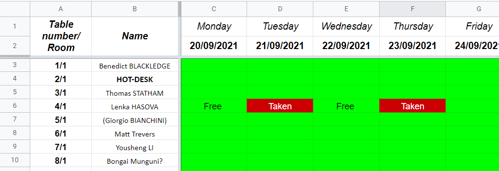

Social distancing in Browns; how many people is in?

<!--more-->

To make people feel more comfortable about coming to Browns, we have created a check-in system. In the linked spreadsheet below, you can find not just the seating plan, but a also a calendar where you can indicate when you plan to be in browns. This way, everyone can see (1) how many people is currently in each room, (2) how many people will be in Browns, and (3) what desks are available for hot-desking. This should give everyone the freedom to decide if it's safe or comfortable for them to come into browns or not.

> [Browns desk check-in & hot-desking](https://uob.sharepoint.com/:x:/r/teams/grp-ggy-postgrad/_layouts/15/Doc.aspx?sourcedoc=%7B8BD03C7F-31EC-4C12-9AD3-CAE26A497B45%7D&file=Browns%20desk%20check-in.xlsx&action=default&mobileredirect=true)

It's simple. Green cells represent available desk spaces and red cells represent booked desk spaces. If you plan to work from a desk in Browns, mark the desk you plan to work out in red. This applies to both your own desk and hot-desks but please do try to remain at your own desk.

