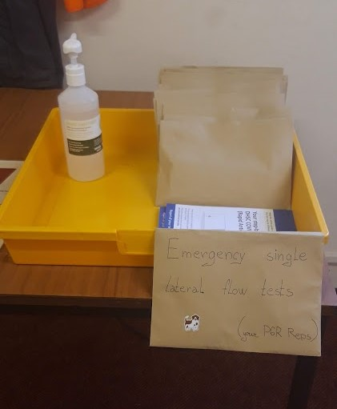

*What are the current rules? What do I need to do the come to Browns again?*

<!--more-->

With COVID-19 restrictions being eased, the university has announced that we can **all come back to browns**. There are 2 conditions;
1. You should **always** wear a mask inside, unless you are eating/drinking or are the only one in the room.
2. You should also **take a lateral flow test (LFT) every 3-4 days**. You can get them for free in pharmacies, or order them online [here](https://www.gov.uk/order-coronavirus-rapid-lateral-flow-tests)
3. Please, use a **[check-in](https://geogbrowns.info/post/21-09-21-check-in/)** to sign into Browns, so everyone knows how many people is in Browns each day.

If your LFT test is positive or you have symptoms, please book a [PCR test](https://www.nhs.uk/conditions/coronavirus-covid-19/testing/get-tested-for-coronavirus/). And if you do get COVID-19 and have been at the university, please follow the [university Covid-19 guidiance](https://uob.sharepoint.com/sites/geographical-sciences/SitePages/COVID-19.aspx) and fill out the [coronavirus self-reporting form](https://www.bristol.ac.uk/report-coronavirus).I might be also helpful if you let someone in your university social circle know. This could be your supervisor, member of staff or just send a message on PGR WhatsApp, or let one of our PGR representatives know, so people can adapt accordingly.

In case you forget to do LF test at home or you start to have symptomps during a day, we left an **emergency single LF tests** at the entrance to browns.

Keep safe!