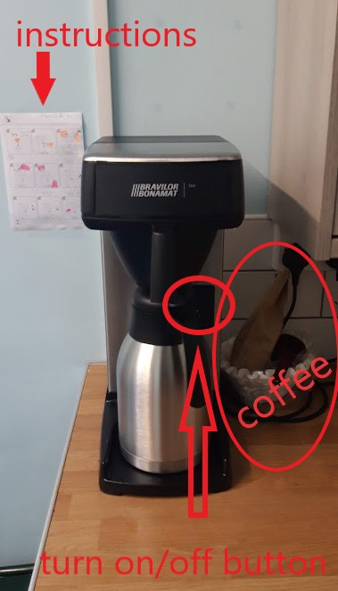
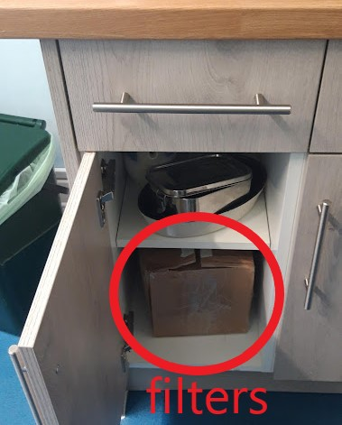

 

<!--more-->

## How to make a coffee

The instructuions for the cofee machine are stuck on the wall on the left side of the coffe machine.
It is a 8 step process;
1. Pour water into jug to measure the amounth (jug = 1l)
2. Pour the measured water into the back of the machine
3. Set a filter into the cone
4. Add coffee into the filter 
5. Slip the cone to the fron of the machine
6. Press the button on the left side of the jug
7. Wait for the coffee machine do the jub, untill only one red light is left by the turn on button
8. **Turn off** the machine by pressing the same button and enjoy the coffee!

## How much coffee do I put in?

roughly 

|        | half a jug | whole jug |
|--------|------------|-----------|
| litres | 0.5        | 1         |
| scoops | 1          | 2         |

Let us know if this works for you or it is to weak or strong.

## Supplies

### Coffee

250g of coffee ground will be delivered each week to the school and will wait in the postal room by the administrative office in the main geography building. If you run out of the coffee grounds, there is a good possibility new one is there.  We need to start using the machine, see how much coffe we go through and then report back if the delivered amounth needs to be increased.

### Filters

Many, many spare filters are placed inside box in the cupboard under the coffee machine. In case you run out (should not be anytime soon), please get in touch with one of our Reps.

### Milk

Milk is provided by the school. We have more oat milk drinkers then normal milk drinkers, so we asked for more oat milk and less normal milk. The milk is not deliver to Browns but will be availiable in the fridge in the geography common room. In case we run out of milk, we just need to pick it up from common room. Just to clarify, this is a common milk, that is for everyone. So do not take milk from common room for yourself only.
