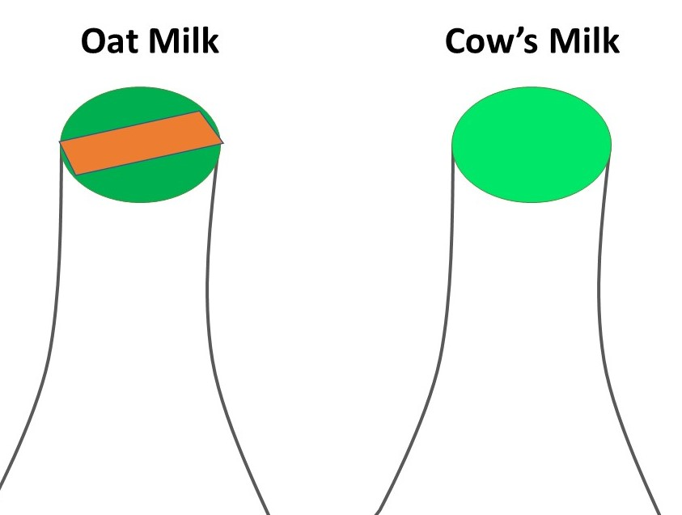

A coffee machine was placed in the Browns today, provided by the school. It is the same coffee machine as the one in Geography common room and is there for anyone to use. Milk and coffee is supplied as well!

 

<!--more-->

## How to make a coffee

The instructuions for the coffee machine are stuck on the wall on the left side of the coffee machine.
It is a 8 step process:
1. Pour water into the jug to measure the amount (jug = 1l)
2. Pour the measured water into the back of the machine
3. Place a filter into the cone
4. Add coffee into the filter 
5. Slip the cone into the front of the machine
6. Press the button on the left side of the jug
7. Wait for the coffee machine to do its job, until only one red light is left by the turn on button
8. **Turn off** the machine by pressing the same button and enjoy the coffee!

## How much coffee do I put in?

roughly 

|        | half a jug | whole jug |
|--------|------------|-----------|
| litres | 0.5        | 1         |
| scoops | 1          | 2         |

Let us know if this works for you or if it is too weak or strong.

## Supplies

### Coffee

250g of ground coffee will be delivered each week to the school and will wait in the postal room by the administrative office in the main geography building. If you run out of the coffee grounds, there is a good possibility new one is there.  We need to start using the machine, see how much coffee we go through and then report back if the delivered amount needs to be increased.

### Filters

Many, many spare filters are placed inside box in the cupboard under the coffee machine. If you run out (should not be anytime soon), please get in touch with one of our Reps.

### Milk

Milk is provided by the school. We have more oat milk drinkers than normal milk drinkers, so we asked for more oat milk and less normal milk. The milk is not delivered to Browns but will be availiable in the fridge in the geography common room. If we run out of milk, we just need to pick it up from common room. Just to clarify, this is a communal milk – for everyone. So do not take milk from common room for yourself only.
