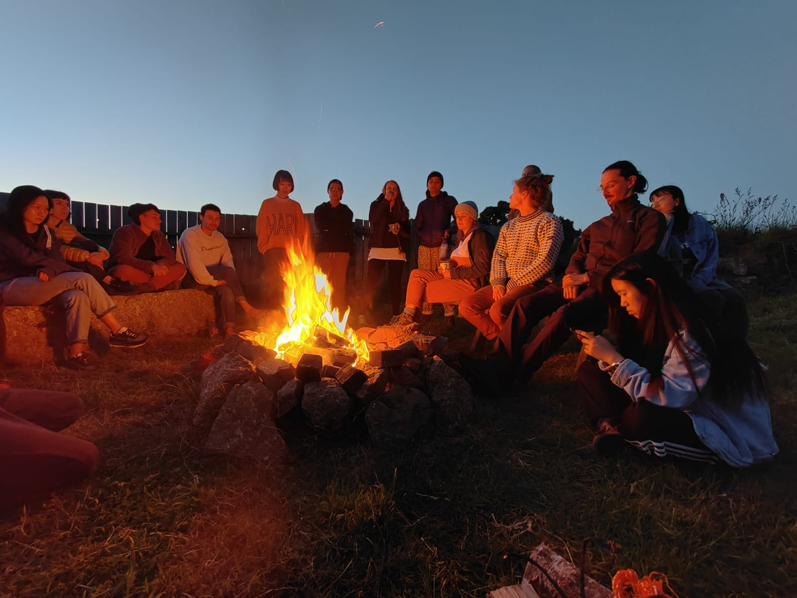
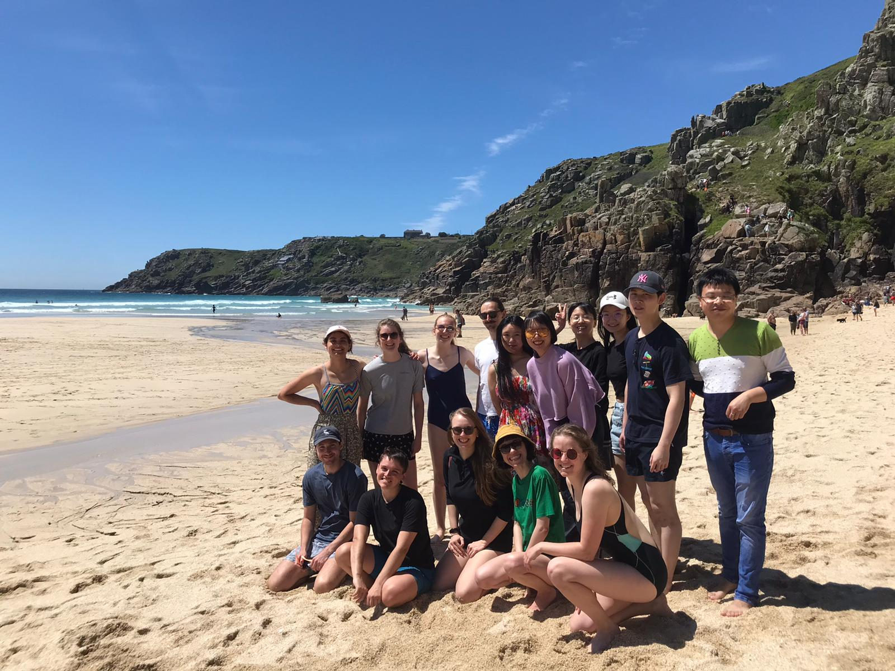

 

<!--more-->

## What is Browns Weekend Away?

Browns Weekend Away is an event organized by PGRs for PGRs every year and is supported by the department. It is usually weekend at the beggining of academic year, during which PGRs spend some time in different location outside Bristol, hiking exploring nature or city, playing games and spending time together. This has traditionally been the main cohort-building event of the year and was designed to include as many PGRs as possible.

Even though we have lost a year and a half to pandemic, we wouldnt like to miss this beloved event. So this year, we decided to take some time off during the jubilee weekend #platyjubs, travel down to Cornwall to enjoy the beatuful nature and spend time with the friends. 

## 1st Day

The first day started around 5:30 for most of us. Quick coffee, pack the toothbrush and get to the meeting point. By 7am, everyone stood outside the Browns with an excited smile and fresh mind, we 'tetrised' our bags and ourselves into three cars, and off we gone. 

Getting up early paid off on low traffic and fairly easy four hour drive down to the tiny village of Tree. The roads started wide but slowly became more narrow, slower, and more rural, while the surrounding changed from filled with forests and farmlands to vast grasslands and rocky plains. 

When we turned up in the campsite just before lunch, the tents were already up thanks to three PGRs who travelled a day early to reserve the best camping spaces for us. The campsite was conveniently located just 2 minute walk from the coastline and had a view on the Atlantic ocean, occupying most of the horizon. 
There was no doubt that our first destination would be the beach. We walked through the coastline shrubs, walked down the steep path and surpassed the last 200 meters of cliffs on all four. The beach consisted of combination of sand and broken seashells, and had a gentle slope so that each wave could travel quite far along and create little pools of water favoured by all the dogs, trying to cool down in such a hot day. The water was so clear and blue, it almost did not look real, and several of us felt like we are just dreaming. We spent the rest of the afternoon sunbathing, reading, talking, throwing around frisbee, walking along the beach and the brave of us also swimming. The water was cold as ice, so stepping in, our feet felt like falling off, but after brief period of adaptation our bodies adjusted and the water became refreshing. 
After the beach we headed to the nearest pub for dinner and pint of cider, energized by the warm weather, cold water and the 'raw' nature. We finished the day playing cards, chatting along around the campfire and sipping whiskey. We could not have asked for more.

## 2nd Day

After the first night sleeping in the tents, we woke up rested and ready for another adventure. We decided to grab a coffee in nearby cafe and hike along the coast towards the famous Land's End. The walk was filled with amazing views of beaches, hidden caves, rolling coastline, and accompanied by calming sound of waves braking on the cliffs.

We managed to get to the Lands End in a right time for lunch, Cornish pasties were particularly delicious fresh warm, and after a long walk. We then split into three groups, one decided to walk the same way back to the camp, second decided to stay around for a while and enjoy the surrounding and attractions, and the last took the 30 minutes bus back to the camp, grabbing some towels and heading on the beach for the rest of the day.

Tired but relaxed, and sun burnt, some more then others, we finished off the day by dinner, body stretches, few mafia party games, sunset watching and evening coastline scrawling.

## 3rd Day

As we expected the rain and moody weather to hit by the morning, we decided to pack up the tents early, get breakfast in a little cafe in near town of Penzance and hit the road back to Bristol. 
Unfortunately, many people had the same idea and we have met with unexpected traffic on a way back, so the last day turned up to be seven hour Browns road trip. Nevertheless, we shortened the time by listening to catchy music, playing catch up with the other cars and driving through the small Cornish and Devon roads, watching the picturesque countryside.

## Thank you

We would like to express huge thanks to the organizers of this trip Zoonii and Saskia, who has took the time to find such an amazing place, organize the registration, equipment and travelled a day ahead to ensure we get the best camping spots. Thank you!

